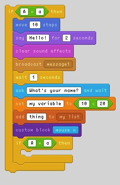

# scratchimg

Create pixel art of Scratch blocks in Python.



```py
stack = Stack(
    [
        Block(
            styles["motion"],
            ["move", Literal("10"), "steps"],
        ),
        Block(
            styles["looks"],
            ["say", Literal("Hello!"), "for", Literal("2"), "seconds"],
        ),
        Block(
            styles["sound"],
            ["clear sound effects"],
        ),
        Block(
            styles["events"],
            ["broadcast", Menu("message1")],
        ),
        Block(
            styles["control"],
            ["wait", Literal("1"), "seconds"],
        ),
        Block(
            styles["sensing"],
            ["ask", Literal("What's your name?"), "and wait"],
        ),
        Block(
            styles["variables"],
            [
                "set",
                Literal("my variable"),
                "to",
                Boolean(
                    styles["operators"],
                    [Literal("10"), "<", Literal("20")],
                ),
            ],
        ),
        Block(
            styles["lists"],
            ["add", Literal("thing"), "to", Menu("my list")],
        ),
        Block(
            styles["custom"],
            [
                "custom block",
                Reporter(
                    styles["sensing"],
                    ["mouse x"],
                ),
            ],
        ),
        C(
            styles["control"],
            [
                "if",
                Boolean(styles["operators"], [Literal("A"), "=", Literal("a")]),
                "then",
            ],
            Stack([]),
        ),
    ]
)
c = C(
    styles["control"],
    ["if", Boolean(styles["operators"], [Literal("A"), "=", Literal("a")]), "then"],
    stack,
)
```
